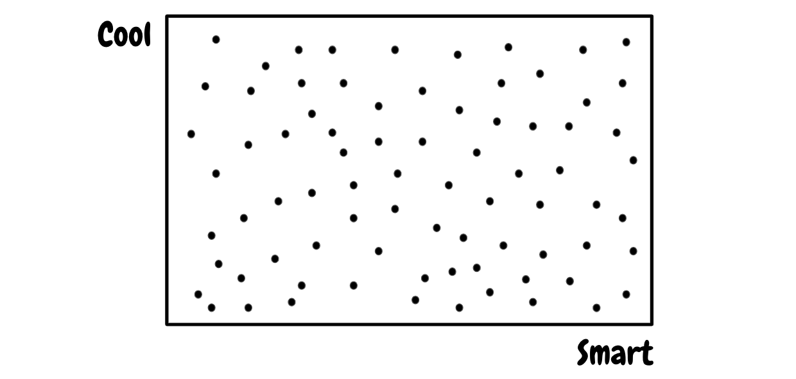
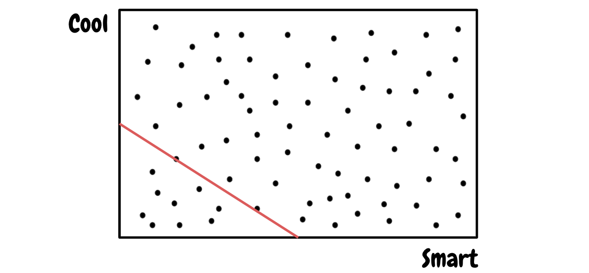
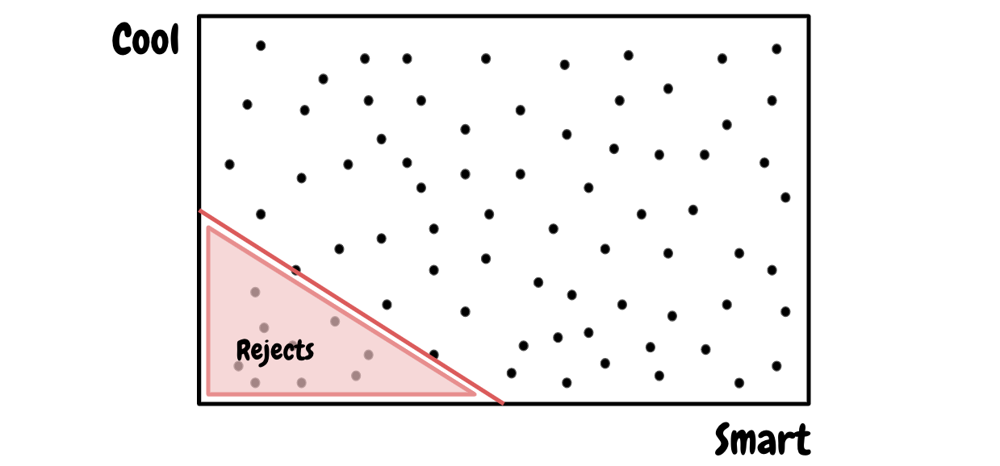
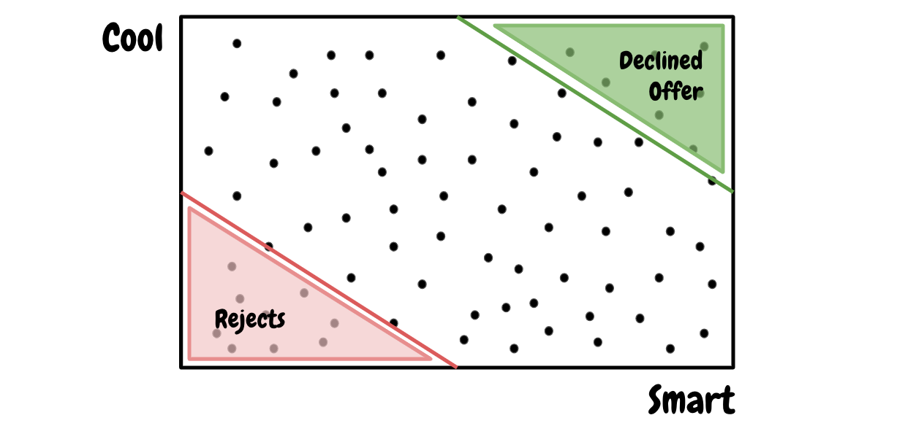
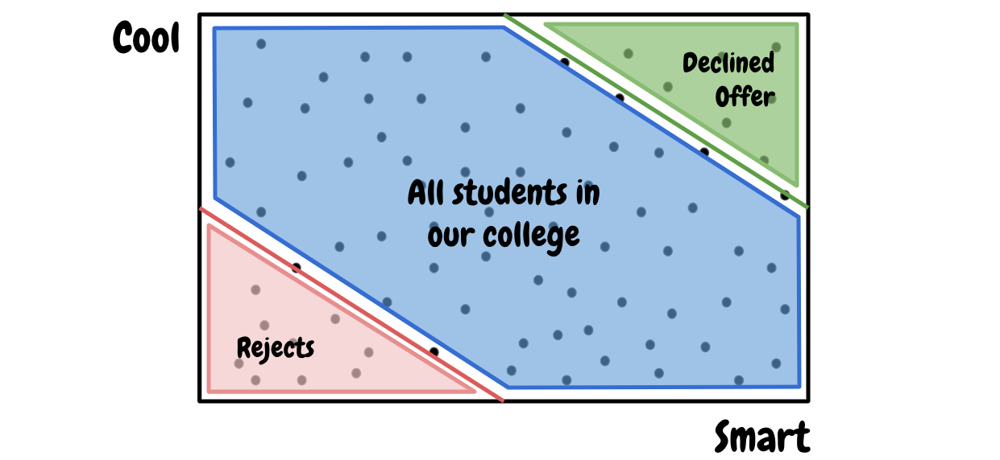
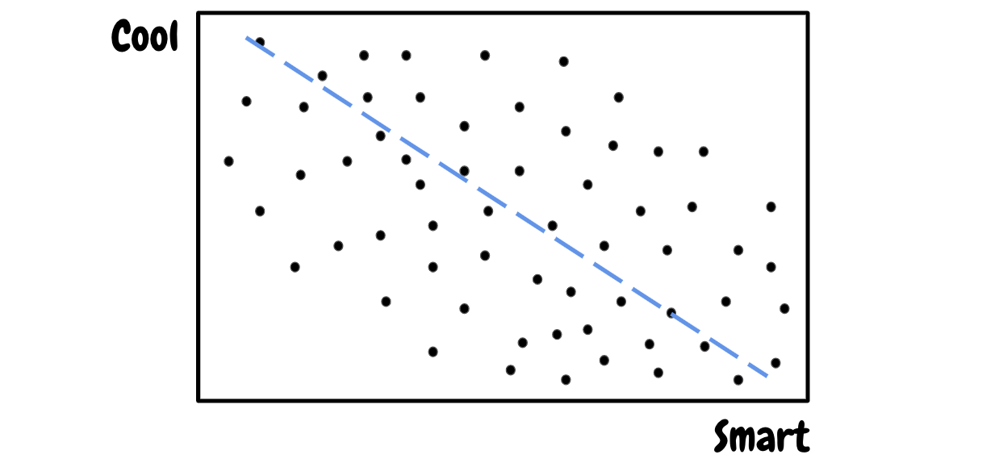
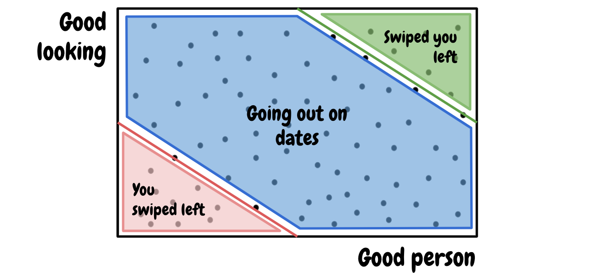
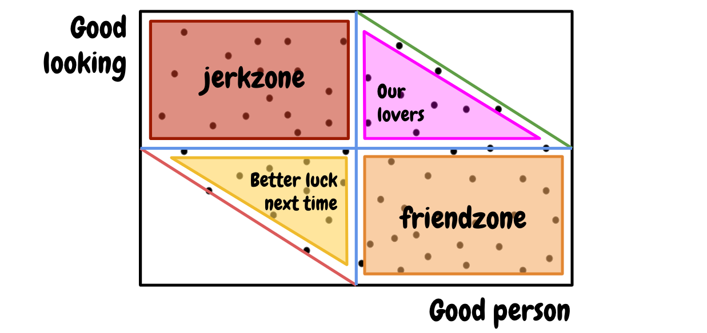
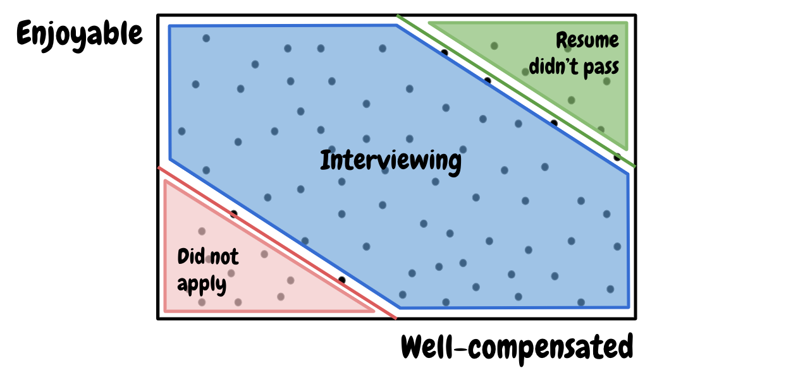

+++
title = "Berkson's Paradox: Mathematically proving growth mindset and plotting the friendzone on a graph"
date = 2022-01-30T16:54:12+08:00
author = "stanleynguyen"
keywords = ["math", "philosophy", "life", "motivation", "growth", "growth mindset"]
cover = "/post/berkson-paradox-and-life/img/cover.png"
summary = "The Berkson's paradox and how it could be applied in our lives"
+++

Ever wonder why all the folks you know from your college are either athletic/
artistically-talented (and all the adjectives synonymous with `cool`) or academically
overachieving but never both, and there seems to be some negative correlation between
coolness and academic gift? Some might find a few super rare schoolmates who are both
but the truth is they shouldn't be in the school and I will tell you why.

Although this correlation is often accepted to be conventional wisdom (Thanks God it's fair 😮‍💨
no one can be both cool and smart), we're staring right at the face of a logical fallacy - namely
Berkson's Paradox.

## So what the hell is Berkson's Paradox?

To avoid being called a math nerd (which I am a huge one admittedly), let's keep the definition
of Berkson's paradox simply **a false observation of negative correlation between two positive traits**.

Let's take a look back at the example we started the article with - the negative correlation between coolness
and smartness in college - and start with the pool of applicants to the school. Assuming there's no prohibition
on whom can or cannot send in an application, we will have an evenly-distributed pool of applicants on both `cool` and `smart` scale.

But of course, our alma mater wouldn't be able to accept every single applicants to be their
students. So as part of the recruitment process, a line (red) is drawn of which only students on
the right are offered a place to the college.

To make it even clearer, let's annotate the entire area

On the other hand, there would be applicants who are offered a place but decline the offer for
places in better schools. Logically, these applicants would be on the top right corner of the
applicant pool (in green).

And that leaves us with our college's student body (in blue)

This student body is what we draw our conclusion from looking at, and obviously there is a clear
negative trend between coolness and smartness.

However, what's not so obvious is that we're only looking at a subset of all prospective students
of our alma mater, instead of the whole picture.

And that, my friend, is what we call Berkson's paradox - a false observation of negative correlation between two positive traits caused by an incomplete identification of data points.

## How do we view life through the lense of Berkson's paradox?

Now let's get to the part we're all most excited about - applying Berkson's paradox to our lives
(or maybe just plotting friendzone on a graph 😂 either one is cool, no judgement).

For the example to be relatable and exciting, we're going to apply Berkson's paradox to the
human phenomenon of dating. Similar to the above example of our college's student body, we are
going to split up our population into 3 segments. (I'm just going to assume everyone who is reading
is familiar with dating apps like [Tinder](https://tinder.com/))

Before you raise your pitchforks while screaming "where is the friendzone?" at me, let's further
segment our dates and potential lovers with into 4 more elaborate sections.

Out of all those who we deem acceptable to go out on dates with, there must be those who are:

- Decent-mannered and decent-looking human-beings (who can eventually become our lovers)
- Decent-looking but not much of a good person (the jerkzone)
- Good person but not good-looking enough (the infamous friendzone)
- Falling short on both aspects (Better luck next time!)

Even under this more elaborated segmentation of the dataset, the eventual segment that will likely
be taken into consideration by most of us, our lovers (purple triangle), displays a negative
correlation between being good-looking and being a good person too. So next time if you hear
someone complaining about why they can't find someome attractive who is also a good person, show
them this post and let them know that it's just a logical fallacy and their Mr./Ms. Right is out
there, just not in their zone, **not yet**.

## How is this related to growth mindset?

Very much the same concept can be applied in a lot of other aspects of our lives too, like this
one I have below for our career.

So what can we do knowing this logical fallacy? The most logical answer for an objectively better
outcome of more career opportunities, or potential lovers is to expand the area of the blue
segment towards top right corner. There are 2 ways of doing this looking at our graphs:

- Moving the green line to the right
- Expanding the boundary box's top and/or right borders



So what do both of these visual "actionables" mean in practical terms? "Moving the green line to
the right" is basically working on improving yourself so you can be eligible for
overall-better jobs, or much more a prize of a date. "Expanding the boundary box's borders" means
meeting more people, getting out of your comfort circles.

Now some of you smartypants might have noticed and pointed out that as we progress ourselves, our
expectations, represented with the red line, might shift as well and we might end up depressed
again. I'd say that at least this way we're better off in absolute terms, and as human-beings, we
will always be cursed with "not getting what we want or getting what we wanted then not knowing
what we want". It's going to take another post to explore this human psyche so I'm going to end
this post here before I start sounding like a motivational speaker instead of a math nerd, of which
I would pick being a math nerd any day over.
