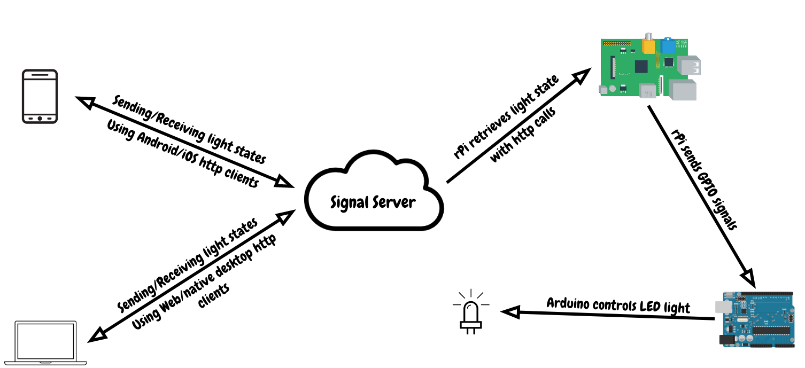

+++
title = "Going Places: How I used Golang for literally every part of a system"
date = 2021-01-01T00:00:00+08:00
author = "stanleynguyen"
keywords = ["go", "golang", "internet of things", "web assembly", "embedded system", "raspberry pi", "arduino"]
cover = "/post/go-everywhere/img/gora.png"
summary = "Fulfilling Java's multi-decade-old promise with Go"
+++

Over the course of technology's esoteric rise, there're many languages that come and go.
And just like for any products, only a few stood the test of time like C, Java - amassing large groups of followers with application in various domains.
Naturally, fans of such languages would try to adapt their favorite tools to their various niched domains, which might not be the originally intended purpose of such languages.
One notable effort was [Sun Microsystems'](https://en.wikipedia.org/wiki/Write_once,_run_anywhere) which ended up being at best the butt of Java Developers' joke `Write Once, Debug Everywhere`, at worst the main source of pain for "cross-platform"-dubbed developers.

Ridiculous as it was, the attempt inspired me to attempt to do the same thing with one of developers' community golden child that has been steadily rising in popularity over the last 10 years since its inception - Golang.
If this post eventually contributes to another `WORA` wildfire (unintentionally of course 🤫 ), please do use this motto `GORA` - Go Once, Run Anywhere!

## The Big Picture

What I'm trying to construct using Go is a simple IoT (Internet-of-Things) system which controls an LED light.
The whole system can be summed up in a single diagram



At the core of the system, we have a server (duh!) that persist the current desired state of the LED light (the "backend").
This state can be altered by the "front-end" clients - the browser app, the mobile app and the Mac 🍎 app, which are all written entirely in Go.
On the other end of the system, I will be using a Raspberry Pi (RPi) to retrieve the LED light state from our server and pass it on to an Arduino controlling the LED light directly (This seems like a longer route but I didn't have a wifi shield for my Arduino 🤷 ).

All communications between components of this system are done through HTTP protocol, which allows me to have a "WORA" HTTP client component injected in different parts of the system to facilitate these calls.

## Signal Server

This is the brain of the system which persists and facilitates the trasmission of the LED light's states in the system.
Interestingly, this is the only portion where Go is used for the purpose it's originally created for.

With Go, I can easily model lights as domain objects

```golang
type lightState int

func (s lightState) string() string {
	switch s {
	case on:
		return "ON"
	case off:
		fallthrough
	default:
		return "OFF"
	}
}

const (
	on = lightState(iota)
	off
)

type light struct {
	state lightState
	mux   sync.Mutex
}

func newLight() light {
	return light{
		state: off,
	}
}

func (l *light) setState(s lightState) {
	l.mux.Lock()
	l.state = s
	l.mux.Unlock()
}

func (l *light) getState() lightState {
	return l.state
}
```

The light state control is then exposed through a set of endpoints to:

- Get the state `GET /led`
- Update it to ON `POST /on`
- Update it to OFF `POST /off`

```go
http.HandleFunc("/led", func(w http.ResponseWriter, r *http.Request) {
  if r.Method != http.MethodGet {
    w.WriteHeader(http.StatusForbidden)
    fmt.Fprint(w, "Method not allowed")
    return
  }

  w.WriteHeader(http.StatusOK)
  fmt.Fprint(w, light.getState().string())
})
http.HandleFunc("/on", func(w http.ResponseWriter, r *http.Request) {
  if r.Method != http.MethodPost {
    w.WriteHeader(http.StatusForbidden)
    fmt.Fprint(w, "Method not allowed")
    return
  }

  w.WriteHeader(http.StatusOK)
  light.setState(on)
  fmt.Fprint(w, "")
})
http.HandleFunc("/off", func(w http.ResponseWriter, r *http.Request) {
  if r.Method != http.MethodPost {
    w.WriteHeader(http.StatusForbidden)
    fmt.Fprint(w, "Method not allowed")
    return
  }

  w.WriteHeader(http.StatusOK)
  light.setState(off)
  fmt.Fprint(w, "")
})
```

With the signal in place for remotely controlling the light through HTTP requests, now we can come to the piece of the puzzle that will be extrapolated to be used in different platforms.

## The lighthttpcli

The light controlling client is basically a http wrapper with self-explanatory methods.

```go
const (
	StateOn  = "ON"
	StateOff = "OFF"
)

type LightHttpCli struct {
	url        string
	httpClient *http.Client
}

func (c LightHttpCli) GetState() (string, error) {
	endpoint := fmt.Sprintf("%s/led", c.url)
	resp, err := c.httpClient.Get(endpoint)
	if err != nil {
		return "OFF", err
	}

	respByte, err := ioutil.ReadAll(resp.Body)
	if err != nil {
		return "OFF", err
	}
	defer resp.Body.Close()

	if resp.StatusCode != http.StatusOK {
		return "OFF", errors.New(string(respByte))
	}

	return string(respByte), nil
}

func (c LightHttpCli) SetState(state string) error {
	endpoint := fmt.Sprintf("%s/%s", c.url, strings.ToLower(state))
	req, _ := http.NewRequest(http.MethodPost, endpoint, nil)
	resp, err := c.httpClient.Do(req)
	if err != nil {
		return err
	}

	respByte, err := ioutil.ReadAll(resp.Body)
	if err != nil {
		return err
	}
	defer resp.Body.Close()

	if resp.StatusCode != http.StatusOK {
		return errors.New(string(respByte))
	}

	return nil
}
```

So how do we `extrapolate` this light controlling clients for all of the promised platforms: Web, Mobile, and Native Desktop?

## Frontend Clients

This is the interesting part where I'm going to use Go on platforms that it's not supposed to be used on just because I can 🤷‍♂.

### Go in Browsers

Let's start with something light-hearted which most of us might have at least heard about - WebAssembly.
I won't go into nitty gritty details of WebAssembly in this post as we all have short attention spans, but basically we just have to write a simple Go script with a main function that will be compiled down to [wasm](https://webassembly.org/) and executed with the help of GoWASM exec script. Read more about Go WebAssembly [here](https://github.com/golang/go/wiki/WebAssembly).

```go
func getStateBtnHandlerFunc(state string, cli lighthttpcli.LightHttpCli) js.Func {
	return js.FuncOf(
		func(this js.Value, args []js.Value) interface{} {
			go func() {
				err := cli.SetState(state)
				if err != nil {
					println(err.Error())
				}
			}()
			return nil
		},
	)
}

func getRefreshStateFunc(bulbElem js.Value, cli lighthttpcli.LightHttpCli) js.Func {
	var prevState string
	return js.FuncOf(
		func(this js.Value, args []js.Value) interface{} {
			go func() {
				state, err := cli.GetState()
				if err != nil {
					println(err.Error())
				}

				if state != prevState {
					if state == lighthttpcli.StateOn {
						bulbElem.Get("classList").Call("add", "on")
					} else {
						bulbElem.Get("classList").Call("remove", "on")
					}
					prevState = state
				}
			}()
			return nil
		},
	)
}

func setup() {
	cli := lighthttpcli.NewCli(js.Global().Get("location").Get("origin").String())
	bulbElem := js.Global().Get("document").Call("getElementById", "bulb")

	js.Global().Set("turnOn", getStateBtnHandlerFunc(lighthttpcli.StateOn, cli))
	js.Global().Set("turnOff", getStateBtnHandlerFunc(lighthttpcli.StateOff, cli))
	js.Global().Call("setInterval", getRefreshStateFunc(bulbElem, cli), 500)
}

func main() {
	c := make(chan struct{}, 0)
	setup()
	println("WASM Go initialized")
	<-c
}
```

The above Go script can then be compiled, conveniently with an in-built Go compiler's feature, into a WebAssembly "binary".

```bash
GOARCH=wasm GOOS=js go build -o static/main.wasm wasm/main.go
```

The result "binary" will bind instructions into the corresponding function names in the browser's JavaScript space after its initilisation in JS.

```html
<script src="wasm_exec.js"></script>
<script>
  const go = new Go();
  let mod, inst;
  WebAssembly.instantiateStreaming(fetch("main.wasm"), go.importObject).then(
    async (result) => {
      mod = result.module;
      inst = result.instance;
      await go.run(inst);
    }
  );
</script>
```

### Go on Native Desktop

To keep the project simple, I decided to just make an Mac status bar application rather than full-fledged UI application.
For this task, conveniently, there's already a popular package [caseymrm/menuet](https://github.com/caseymrm/menuet).
I only have to define my status bar app as below and bind the different functions of `lighthttpcli` to UI interactions.

```go
var cli = lighthttpcli.NewCli(serverURL)

func intervalStateRefresh() {
	ticker := time.NewTicker(500 * time.Millisecond)
	var prevState string
	for {
		<-ticker.C
		state, _ := cli.GetState()
		if state != prevState {
			menuet.App().SetMenuState(&menuet.MenuState{
				Title: fmt.Sprintf("Light is: %s", state),
			})
			prevState = state
		}
	}
}

func menuItems() []menuet.MenuItem {
	onBtn := menuet.MenuItem{
		Text: "Turn On",
		Clicked: func() {
			cli.SetState(lighthttpcli.StateOn)
		},
	}
	offBtn := menuet.MenuItem{
		Text: "Turn Off",
		Clicked: func() {
			cli.SetState(lighthttpcli.StateOff)
		},
	}
	return []menuet.MenuItem{onBtn, offBtn}
}

func main() {
	go intervalStateRefresh()
	menuet.App().Label = "com.github.stanleynguyen.goeverywhere"
	menuet.App().Children = menuItems
	menuet.App().RunApplication()
}
```

### Go on Mobile

This part is one that I struggled the most with as the [gomobile package](https://github.com/golang/mobile) is unstable and also lacks documentation and guides (as we all could have guessed that it's rarely used in a practical sense).

Creating the app is relatively straight-forward as I went with a full-screen setup that indicates the light's state by its background color and toggles the state upon any touch events.

```go
func main() {
	stateChan := make(chan string)
	go checkState(stateChan)
	app.Main(func(a app.App) {
		var glctx gl.Context
		state := "OFF"
		for {
			select {
			case state = <-stateChan:
				a.Send(paint.Event{})
			case e := <-a.Events():
				switch e := a.Filter(e).(type) {
				case lifecycle.Event:
					glctx, _ = e.DrawContext.(gl.Context)
				case paint.Event:
					if glctx == nil {
						continue
					}
					if state == "ON" {
						glctx.ClearColor(1, 1, 0, 1)
					} else {
						glctx.ClearColor(0, 0, 0, 1)
					}
					glctx.Clear(gl.COLOR_BUFFER_BIT)
					a.Publish()
				case touch.Event:
					if state == "ON" {
						lightHTTPCli.SetState("OFF")
					} else {
						lightHTTPCli.SetState("ON")
					}
				}
			}
		}
	})
}
```

To install on Android devices, this Go program can then be compiled into an apk with the help of [gomobile](https://github.com/golang/mobile) with the [ndk-bundle](https://developer.android.com/ndk/downloads) in the same folder.

```bash
ANDROID_HOME=$(pwd) gomobile build -ldflags "-X main.serverURL=<your server url>" -o light.apk github.com/stanleynguyen/go-everywhere/mobo
```

## Edge Node

Now that we have settled all of our "frontend" clients, it's time to translate the software signal into some actual hardware and light up some LEDs!

### Raspberry Pi 🥧

As you're reading this, you might be wondering why didn't we just let the Arduino controller get the light state directly and control the LED.
The main reason behind the decision was because I didn't have an internet shield for my Arduino but hey, what's the harm in tallying up my platform count by a point 🤷‍♂️?

For the RPi to be the desired "middle-person" controller, we simply need it to poll for the light state and pass the signal onto an output pin.

```go
var serverURL = "http://localhost:8080" // Inject at build time with -ldflags "-X main.serverURL=http://something"
var pinNumberStr = "16"                 // Inject at build time with -ldflags "-X main.pinNumber=21"

var cli = lighthttpcli.NewCli(serverURL)

func main() {
	if err := rpio.Open(); err != nil {
		log.Fatal(err)
		os.Exit(1)
	}
	defer rpio.Close()
	pinNumber, _ := strconv.Atoi(pinNumberStr)
	pin := rpio.Pin(pinNumber)
	pin.Output()
	stateChan := make(chan string)
	go pollLightState(stateChan)
	prevState := "OFF"
	pin.Low()
	for {
		state := <-stateChan
		if state != prevState {
			if state == "ON" {
				pin.High()
			} else {
				pin.Low()
			}
			prevState = state
		}
	}
}

func pollLightState(stateChan chan<- string) {
	for {
		state, _ := cli.GetState()
		stateChan <- state
		time.Sleep(500 * time.Millisecond)
	}
}
```

And thanks to Go's build system's versatility, I can easily compile a binary that can be run on RPi **on my Macbook** by setting some simple flags.

```bash
GOOS=linux GOARCH=arm GOARM=5 go build -o pi.out -ldflags "-X main.serverURL=<your server url> -X main.pinNumber=<output pin number>" pi/main.go
```

### Arduino

So finally, we have come to the last piece of the puzzle.
The Arduino only has a simple job of reading from an input pin that receive signals from the RPi and output to a pin that will complete the circuit and light up the LED 💡.

```go
package main

import (
	"machine"
	"strconv"
	"time"
)

var outPinStr = "9" // Inject at build time with -ldflags "-X main.outPinStr=9"
var inPinStr = "7"  // Inject at build time with -ldflags "-X main.outPinStr=7"

func main() {
	outPinNumber, _ := strconv.Atoi(outPinStr)
	inPinNumber, _ := strconv.Atoi(inPinStr)
	var outPin machine.Pin = machine.Pin(outPinNumber)
	var inPin machine.Pin = machine.Pin(inPinNumber)
	outPin.Configure(machine.PinConfig{Mode: machine.PinOutput})
	inPin.Configure(machine.PinConfig{Mode: machine.PinInput})
	for {
		outPin.Set(inPin.Get())
		time.Sleep(time.Millisecond * 200)
	}
}
```

The special part about this code is the `machine` package that's not a built-in but provided within the build environment of [tinygo](https://github.com/tinygo-org/tinygo).
All the heavy-lifting of flasing into our micro-controllers is done by [tinygo](https://github.com/tinygo-org/tinygo) as well, making it a piece of cake 🍰 to work with micro-controllers.

```bash
tinygo flash -target arduino uno/main.go
```

## System in Action

Now it's time for some unveiling and see the system in action 🤩.
The complete source code can be found in [this repo](https://github.com/stanleynguyen/go-everywhere).



## Famous Last Words

Just because we can doesn't mean we should.
Go becoming widely adopted and Gophers are going places but that doesn't mean Go should be used in every single possible place.
If there's any lessons that we could learn from Sun's WORE being the programmer's butt of joke, it's to use the right tool for the right job.

## Bonus: Turning Web Assets into Go

Aren't our web assets part of the system as well?
So to make it completely `Go`, we've gotta some how make them part of the Go code.
The most obvious choice for that is to turn them into binaries and embed right inside our backend code.
This task is relatively simple with a wide range of tools to choose from.
For this project, I went with [statik](https://github.com/rakyll/statik), and simply generate the embeddings with this command.

```bash
statik -src static/ -include=*.html,*.css,*.js,*.wasm
```

These embeddings can be used just like a normal file system in my backend code.

```go
import (
  "github.com/rakyll/statik/fs"
	_ "github.com/stanleynguyen/go-everywhere/statik"
)
...
  // serve static site
	statikFS, err := fs.New()
	fileSys := http.FileServer(statikFS)
  http.Handle("/", fileSys)
...
```
