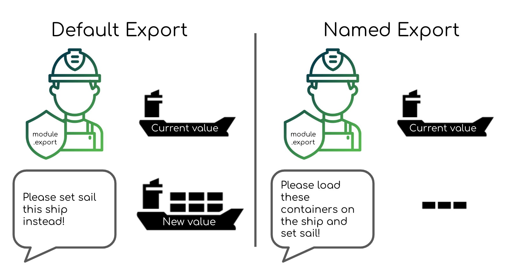

+++
title = "Node Module Exports Explained - With JavaScript Export Function Examples"
date = 2021-02-12T23:53:41+08:00
author = "stanleynguyen"
keywords = ["nodejs", "javascript", "export", "module", "require", "package"]
cover = "/post/node-module-exports-explained-with-javascript-export-function-examples/img/cover.jpg"
summary = "A complete guide to Node.js module exports"
+++

One of the most powerful things about software development, and how software has been progressing at an amazing rate is the ability to reuse, build up-on the foundations of other people.
This wonderful mechanism is, without any doubt, critical on a micro-level of individual projects and the respective teams.
For Node.js, this process of code sharing - within individual projects and external npm dependencies - is facilitated using `module.exports` or `exports`.

## The Basic

How do we use module exports to plug an external module, or sensibly break our project down into multiple files (modules)?

Node.js' module system came about as the language designers didn't want it to suffer from the same problem of a broken global scope like its browser counterpart.
They implemented the [CommonJS specification](https://en.wikipedia.org/wiki/CommonJS) to achieve this.

The 2 important pieces of the puzzle are `module.exports` and `require` function.

### module.exports

`module.exports` is actually a property of the `module` object.
This is how the `module` object looks like when we `console.log(module)`

```bash
Module {
  id: '.',
  path: '/Users/stanleynguyen/Documents/Projects/blog.stanleynguyen.me',
  exports: {},
  parent: null,
  filename: '/Users/stanleynguyen/Documents/Projects/blog.stanleynguyen.me/index.js',
  loaded: false,
  children: [],
  paths: [
    '/Users/stanleynguyen/Documents/Projects/blog.stanleynguyen.me/node_modules',
    '/Users/stanleynguyen/Documents/Projects/node_modules',
    '/Users/stanleynguyen/Documents/node_modules',
    '/Users/stanleynguyen/node_modules',
    '/Users/node_modules',
    '/node_modules'
  ]
}
```

The above object basically describes an encapsulated module from a js file with `module.exports` being the exported component of any types - object, function, string, etc.
Default exporting in a Node.js module is as simple as

```js
module.exports = function anExportedFunc() {
  return "yup simple as that";
};
```

There's another way of exporting from a Node.js module called "named export", which is instead of assigning the whole `module.exports` to a value we would assign individual properties of the default `module.exports` object to values.
Something like

```js
module.exports.anExportedFunc = () => {};
module.exports.anExportedString = "this string is exported";

// or bundled together in an object
module.exports = {
  anExportedFunc,
  anExportedString,
};
```

Named export can also be done more concisely with the module-scoped `exports` predefined variable

```js
exports.anExportedFunc = () => {};
exports.anExportedString = "this string is exported";
```

However, assigning the whole `exports` variable to a new value won't work, which we will discuss why in a later section, and often confuses Node.js developers.

```js
// This wont work as we would expect
exports = {
  anExportedFunc,
  anExportedString,
};
```

If we imagine Node.js module exports as shipping containers, with `module.exports` and `exports` as port personnel whom we would tell which "ship" (i.e. values) we want to get to a "foreign port" (i.e. another module in the project), "default export" would be telling `module.exports` which "ship" to set sail while "named export" would be loading different containers onto the ship that `module.exports` is going to set sail.



Now that we have sent the ships sailing, how do our "foreign ports" reel in the exported ship?

### require

On the receiving ends, Node.js modules can import by `require`-ing the exported value.

Let's say this was written in `ship.js`

```js
...
module.exports = {
  containerA,
  containerB,
};
```

We can easily import the "ship" in our `receiving-port.js`

```js
// importing the whole ship as a single variable
const ship = require("./ship.js");
console.log(ship.containerA);
console.log(ship.containerB);
// or directly importing containers through object destructuring
const { containerA, containerB } = require("./ship.js");
console.log(containerA);
console.log(containerB);
```

An important point to note about this foreign port operator - `require` - is that the person is adamant about receiving ships that were **sent by `module.exports` from the other side of the sea**.
This leads us to the next section where we will address a common confusion.

## The Confusion - `module.exports` or `exports`?

Now that we have gone through the basics of module exporting and requiring, it's time to address one of the common sources of confusion in Node.js modules.

The common module exports mistake that people who are starting out with Node.js often make is to assign `exports` to a new value thinking that it's the same as "default exporting" through `module.exports`.
However, this will not work because:

- `require` will only use the value from `module.exports`
- `exports` is a module-scoped variable that refers to `module.exports` initially

So by assigning `exports` to a new value, we're effectively pointing the value of `exports` to another reference away from the initial reference to the same object as `module.exports`.
If you want to learn more about this technical explanation, [the Node.js official documentation](https://nodejs.org/api/modules.html#modules_exports_shortcut) is a good place.

Back to the analogy that we made previously using ships and operators, `exports` is another port personnel that we could inform about outgoing ship.
At the start, both `module.exports` and `exports` have the same piece of information about the outgoing "ship".
However, if we tell `exports` that the outgoing ship would be another one (i.e. assigning `exports` to a completely new value), whatever that we tell the person afterwards (i.e. assigning properties of `exports` to values) won't be on the ship that `module.exports` is actually setting sail to be received by `require`.
On the other hand, if we only tell `exports` to "load some containers on the outgoing ship" (i.e. assigning properties of `exports` to value), we would actually end up loading "containers" (i.e. property value) onto the ship that is actually being set sail to.

Based on the common mistake explained above, we could definitely develop some good convention around using CommonJS modules in Node.js

## A sensible strategy

Of course the convention offered below is entirely from my own assessments and reasonings.
If you have a stronger case for an alternative, please don't hesitate to tweet me [@stanley_ngn](https://twitter.com/stanley_ngn).

The main things I want to achieve with this convention are:

- eliminating confusion around `exports` vs `module.exports`
- ease of reading and higher glanceability with regards to module exporting

Hence, I'm proposing that we would consolidate exported values at the bottom of the file like so

```js
// default export
module.exports = function defaultExportedFunction() {};
// named export
module.exports = {
  something,
  anotherThing,
};
```

Doing so would eliminate any disadvantages in terms of conciseness that `module.exports` has versus shorthand `exports`, hence removing all incentives for us to use the confusing and potentially harmful `exports`.
This practice would also make it very easy for code reader to glance and learn about exported values from a specific module.

## Going beyond CommonJS

There's a new, and better (of course!) standard that's recently introduced to Node.js called `ECMAScript modules`.
[ECMAScript modules](https://nodejs.org/api/esm.html) used to be only available in code that will eventually need transpilation from [babel](https://babeljs.io/), or as part of an experimental feature in Node.js version 12 or older.
It's a pretty simple and elegant way of handling module exporting.
The gist of it can be summed up with default export being

```js
export default function exportedFunction() {}
```

and named export looking like

```js
// named exports on separate LOC
export const constantString = "CONSTANT_STRING";
export const constantNumber = 5;
// consolidated named exports
export default {
  constantString,
  constantNumber,
};
```

These values can then easily be imported on the receiving end

```js
// default exported value
import exportedFunction from "exporting-module.js";
// import named exported values through object destructuring
import { constantString, constantNumber } from "exporting-module.js";
```

No more confusion from `module.exports` vs `exports` and a nice, human-sounding syntax!
There are definitely projects that are yet migrated to Node.js version 14 and above to make use of this new syntax.
However, if you do have a chance (because you are starting a new project, or your project has successfully been migrated to Node.js 14 and above), there's no reason not to switch to this awesome futuristic way of doing things.
