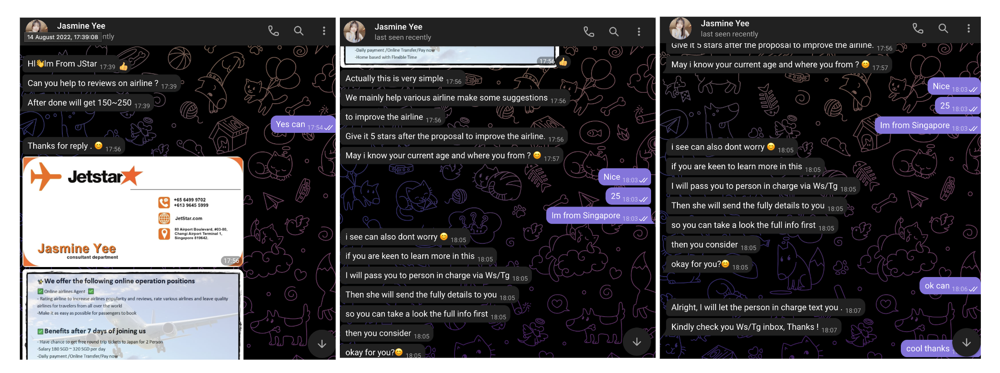
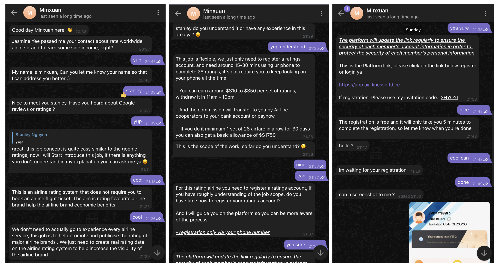
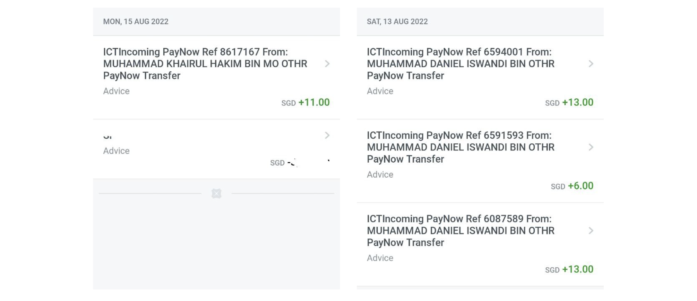

+++
title = "How to scam scammers for profits and a web3 proposal to fight scams"
date = 2022-08-19T01:00:53+08:00
author = "stanleynguyen"
keywords = ["scam", "swindle", "fraud", "web3", "decentralized autonomous organization", "crypto", "blockchain", "community", "dao"]
cover = "/post/scam-the-scammers-web3-fighting-scam/img/cover.png"
summary = "A guide to getting your lunch money from scammers and how we can use web3 to rally a community to fight scam"
+++

If you are reading this, you have probably encountered scam calls/messages/emails at least once in your life.
It's easy for most of us digital natives to tell a scam website from the real one, life's good, and scam messages are just little annoyances.
Unfortunately, scams are actually [running rampant](https://www.channelnewsasia.com/singapore/ocbc-phishing-scam-more-losses-victims-reported-2469086), most prominently the [recent case of an OCBC bank holder](https://mothership.sg/2022/01/singaporean-man-lose-ocbc-savings/), and a lot of other small love, jobs, COVID summons scams that went unnoticed as they're of smaller scales (a few hundred to a few thousand dollars).

Back in my college days, after watching [this TED talk](https://www.ted.com/talks/james_veitch_this_is_what_happens_when_you_reply_to_spam_email) from [a comedian called James Veitch](https://www.youtube.com/c/jamesveitch), I took it as a personal mission to reply to each and every single one of Nigerian princes' letters for me (I had my spam mail filters off as a habit to not miss out on important emails so I would actually get these "letters" almost everyday) as a form of doing good sitting in my own (bat) cave.
Fast forward to 2021, scammers now have somehow gotten my phone number and become so entrepreneurial that they start to offer me work-from-anywhere jobs.

Let's do a case study on how this type of scams is carried out.

## Life-cycle of a job scam

I'm going to use the most recent one that I received as an example to go through how this common scam plays out.

### Step 1: Qualifying the leads

Usually the scam cartel will start by casting their nest wide and trying to hit up as many contacts as possible.
However, they wouldn't have enough skilled scammers who can take it to the next level so they will hire loads of small pawns who will follow an exact script to qualify leads.

Here Jasmine is trying to qualify me as a lead, typical first step of a sales pipeline.

### Step 2: Presenting the "opportunity"

Now that the susceptible victim has been hooked, it's time for the real skilled scammers to start their pitches.

Usually, for job scams like what Minxuan was trying to pitch me, there would be a platform (Yes, they build a platform, though super sloppy 🙄).
The scammer would then instruct the victim to do some activity for compensation with the first round being free trial (Some of you smartypants might have seen an **actual** opportunity for profits here but let's discuss in a later section).

### Step 3: Reeling it in

After sending rewards from the trials, of course the platform will require victims to pay for a membership fee of a couple thousands of dollars.
But fret not, because they can make it back in no time! And poof, that's money down the drain.

Unfortunately, for this step I didn't keep any messages from scammers for examples (I was blacklisted by Minxuan) but I guess at this point you know how it goes.

## How to profit off scammers

Now onto the juicy part, as most of you smartypants would have guessed by now, our opportunity is at the second step when the bait is presented.
We can actually take the bait for some chump-change-satisfaction and never return.

Sometimes, if we're lucky enough (which happens more often that you think since they don't expect people to be out to get them), their "referral code" is not one-time-use, rendering the platform "farm-able".
There was once I wrote a script to farm a platform and managed to do it for 5 times before getting flagged by the scammer (In hindsight, it could have lasted longer had I distribute my attempts over a longer period).
He even threatened that I'm obliged to buy a membership due to my misconduct.
His cartel subsequently seems to have blacklisted me somehow that I just got cruelly told off by Minxuan to "go have fun with others".

Of course these small chump changes that I've been making wouldn't make a dent to their earnings as their usual "membership" costs over a hundred times of that.
However, this is where it get interesting. What if everyone stop after the "free trial" and not pay for "membership"?
The scamming cartel will not be profitable anymore. This is why they have step one to weed out anyone that's not susceptible enough that might waste their time and money.
This is also why for most of the spam mails that you got, they are written in such bad English that they're **obviously** not to be replied.
However, they're just not meant for us but rather a niched group of potential scam victims.

Knowing this, we can safely say that if each and everyone of us make their lead qualification step ineffective by answering and wasting their resources (Fighting scam in offense mode baby!), most of these scam cartels won't be profitable anymore and will go out of existence. Life is good, right?
However, there's one more problem, people also waste their time when they reply to scam emails/texts.
How do we incentivise people to rally behind this same goal of fighting scam?

## A web3 proposal to fighting scam

As we might all have seen in the web3 space, DAOs (Distributed Autonomous Organisations) is a fantastic way of getting people to work together towards the same missions like what [MakerDAO](https://makerdao.com/) and [GitCoin](https://gitcoin.co/) have been doing for **web3 buidlers**.

What if we have a ScamDAO where people can earn `$SCAM` tokens by replying to spam/scam messages.
Imagine people can just log in, view a list of automatically "curated content", and reply to and follow up on thread that they like.
The deeper people can get on these threads, the higher earning per reply they can make (We will go into why it should be this way in a bit).
Each `$SCAM` token will act as a share in ScamDAO, with voting rights for organisational decisions and distribution of earnings.

Now you might be asking about the other side of the equation. Where do the earnings come from?

To make it sustainable, there're two ways we can monetise activities from ScamDAO.

- **Data**: With the amount of data that we generate from all these activities, we could actually build datasets for training spam filters and/or building SaaS spam filters. Our datasets can serve a different purpose beyond what mail servers usually are able to grab from their messages which consists of mostly first-step messages (as they're proactively filtering out and not letting them run for more correspondences). This could be a great unique selling point, which is why we might want to reward our DAO members more as they get deeper in the threads.
- **Trainings**: Have you ever done one of those phishing security trainings at any MNCs? They're usually super boring, templated, and laser-focused on protecting against scammers' lead qualification. With the data from ScamDAO, we can build trainings that are interactive, up-to-date, and done completely automated by a generative machine learning model. Scammers constantly come up with new tricks, why do our trainings always stay the same?

## Outro

In my opinion, fighting scam in defense mode means we have already lost half the battle (Just imagine a war where your tactics are publicly available and easily studied).
We have to be more radical and fight scams **together** for the good of every Internet citizen!
