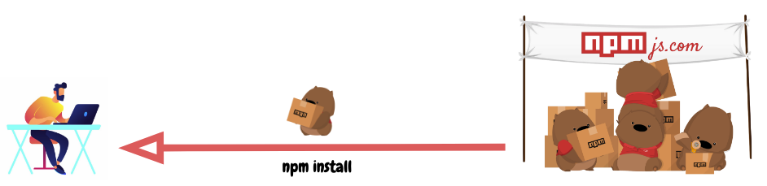
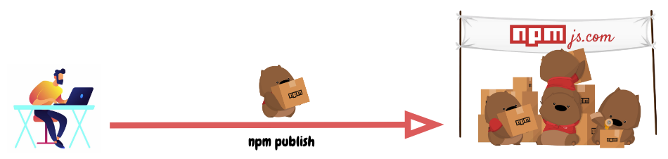
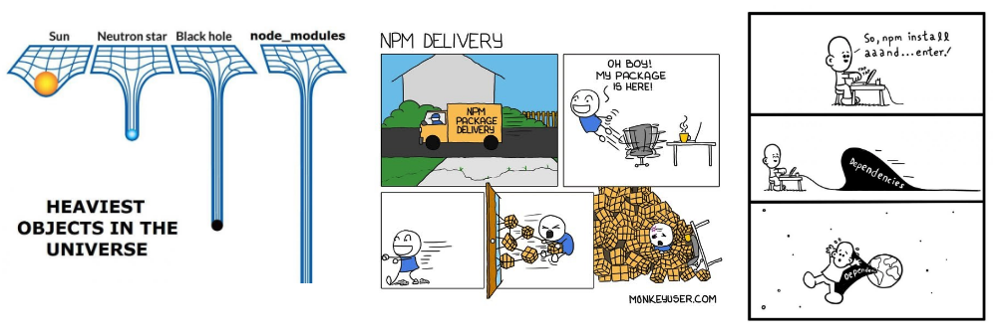
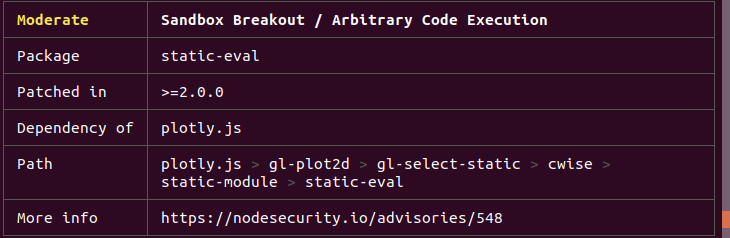

+++
title = "What is npm? A Node Package Manager Tutorial for Beginners"
date = 2020-06-28T11:09:13+08:00
author = "stanleynguyen"
keywords = ["npm", "package manager", "javascript", "nodejs"]
cover = "posts/npm/img/cover.png"
summary = "An all-in-one essential guide for Node.js users' best sidekick"
+++

Node.js has been taking the world by storm since 2009 - with hundreds of thousands of systems built using Node.js, having the developers community dubbing "JavaScript is eating software".
One of the major contributing factors to Node.js' success is npm - its sidekick package manager, allowing JavaScript developers sharing useful packages like [lodash](https://www.npmjs.com/package/lodash), [moment](https://www.npmjs.com/package/moment) in a breeze.
As of the moment I'm writing this post, npm has facilitated the publications of over 1.3 million packages with a weekly download rate of over 16 billion!!
These numbers look fantastic for any software tools, so what exactly is npm?

## NPM in essence

NPM - "Node Package Manager", also known as "Ninja Pumpkin Mutants", "Nonprofit Pizza Makers" (and a host of other random names that you can explore and probably contribute to over at [npm-expansions](https://github.com/npm/npm-expansions)), is the default package manager for JavaScript's runtime Node.js.
NPM consists of two main parts:

- a CLI (Command-line interface) tool for publishing and downloading of packages
- an [online repository](https://www.npmjs.com/) that hosts JavaScript packages

For a more visual explanation, we can think of the repository [npmjs.com](https://npmjs.com) as a fulfilment center that receives packages of goods from sellers (npm package authors) and distributes these goods to buyers (npm package users).
To facilitate this process, [npmjs.com](https://npmjs.com) fulfilment center employs an army of hardworking wombats (npm CLI) who will be assigned as personal assistants to each individual [npmjs.com](https://npmjs.com) customers.
So dependencies would be delivered to JavaScript developers like

and the process of publishing a package for your JS mates would be something like

Let's look at how this army of wombats help developers who are looking to use JavaScripts packages in their projects, and open-source wizards get their cool libraries around the world.

## package.json

Every project in JavaScript - be it Node.js or browser application - can be scoped as an npm package with its own package information and it's `package.json` job to describe the project.
We can think of `package.json` as stamped labels on them npm good boxes that our army of Wombats deliver around.

`package.json` will be generated when `npm init` is ran to initialise a JavaScript/Node.js project, with these basic metadata provided by us developers:

- `name`: the name of your JavaScript library/project
- `version`: the version of your project. Often times, for application development, this field is often neglected as there's no apparent need for versioning like opensource libraies, however, it can come handy as a source of deployment's version.
- `description`: the project's description
- `license`: the project's license

### npm scripts

`package.json` also supports a `scripts` property that can be defined to run command-line tools that are installed in the project's local context.
For example, the `scripts` portion of an npm project can look something like

```json
{
  "scripts": {
    "build": "tsc",
    "format": "prettier --write **/*.ts",
    "format-check": "prettier --check **/*.ts",
    "lint": "eslint src/**/*.ts",
    "pack": "ncc build",
    "test": "jest",
    "all": "npm run build && npm run format && npm run lint && npm run pack && npm test"
  }
}
```

with `eslint`, `prettier`, `ncc`, `jest` not necessarily installed as global executables but rather local to your project inside `node_modules/.bin/`.

A recent introduction of [npx](https://www.freecodecamp.org/news/npm-vs-npx-whats-the-difference/) allows us to run these `node_modules` project-scoped commands just like a globally installed program by prefixing `npx ...` (i.e. `npx prettier --write **/*.ts`)

### dependencies vs devDependencies

These 2 comes in form of key-value objects with npm libraries' names as key and their [semantic-formatted](https://semver.org/) versions as value.
This is an example from [Github's TypeScript Action template](https://github.com/actions/typescript-action)

```json
{
  "dependencies": {
    "@actions/core": "^1.2.3",
    "@actions/github": "^2.1.1"
  },
  "devDependencies": {
    "@types/jest": "^25.1.4",
    "@types/node": "^13.9.0",
    "@typescript-eslint/parser": "^2.22.0",
    "@zeit/ncc": "^0.21.1",
    "eslint": "^6.8.0",
    "eslint-plugin-github": "^3.4.1",
    "eslint-plugin-jest": "^23.8.2",
    "jest": "^25.1.0",
    "jest-circus": "^25.1.0",
    "js-yaml": "^3.13.1",
    "prettier": "^1.19.1",
    "ts-jest": "^25.2.1",
    "typescript": "^3.8.3"
  }
}
```

These dependencies are installed via `npm install` command with `--save` and `--save-dev` flags, and meant to be used for production and development/test environments respectively.
We will drill deeper into the installation of these packages in the next section.
Meanwhile, it's important to understand the possible signs that come before the semantic versions (assuming you have read up on `major.minor.patch` model of [semver](https://semver.org/)):

- `^`: latest minor release. For example, a `^1.0.4` specification might install version `1.3.0` if that's the latest minor version in the `1` major series.
- `~`: latest patch release. In the same way as `^` for minor releases, `~1.0.4` specification might install version `1.0.7` if that's the latest minor version in the `1.0` minor series.

All of these exact package versions will be documented down in a generated `package-lock.json` file.

### package-lock.json

This file describe the exact versions of the dependencies used in an npm JavaScript project.
If `package.json` is a generic descriptive label, `package-lock.json` is an ingredient tables.
And just like how we don't read the ingredient table of a product (unless you are too bored or too free), `package-lock.json` is not meant to be read line-by-line by developers (unless we're desperate to resolve "works in my machine" issues).
`package-lock.json` is usually generated by `npm install` command, and also read by our NPM CLI tool to ensure reproduction of build environments for the project with `npm ci`.

## Guide to effectively command NPM Wombats as a "buyer"

As inferred from 1.3m published packages vs 16b downloads statistic mentioned earlier, majority of npm users use npm in this direction.
So it's good to offer a quick guide on the important concepts to wield this powerful tool.

### npm install

This is the most used command as we developer JavaScript/Node.js applications nowadays.
By default, `npm install <package-name>` will install the latest version of a package with `^` version sign.
An `npm install` within the context of an npm project will download packages into the project's `node_modules` folder according to `package.json` specifications, upgrading package version (and in turn regenerate `package-lock.json`) wherever it can based on `^` and `~` version matching.
A global flag `-g` can also be specified if you want to install a package in the global context which can be used anywhere across your machine and commonly for command-line tooling package like [live-server](https://github.com/tapio/live-server).
npm has made installing JavaScript packages so easy that this command is often used incorrectly, resulting in npm being the butt of a lot of programmers' jokes like these



`--production` flag comes to the rescue! In the previous section, we discussed `dependencies` and `devDependencies` meant for usage in production and development/test environment respectively.
This `--production` flag is how the differences in `node_modules` are made.
By attaching this flag to `npm install` command, we will only install packages from `dependencies`, and thus drastically reduce the size of our `node_modules` to whatever that is absolutely necessary for our applications to be up and running.
Just like how as boy and girl scouts we didn't bring lemon squeezers to our lemonade booth, we shouldn't bring `devDependencies` to production!

### npm ci

So if `npm install --production` is optimal for production environment, must there be a command that's optimal for my local development, testing setup?

The answer is `npm ci`.

As `package-lock.json`, if doesn't already exists in the project, is generated whenver `npm install` is called, `npm ci` consume this file to download the exact version of each individual package that the project depends on.
This is how we can make sure that the our project's context stays exactly the same across different machines, be it our laptops used for development, or CI (Continuous Integration) build environments like Github Actions.

### npm audit

With the humongous amount of packages published and easily installed, npm packages are susceptible to bad authors with malicious intentions like [these](https://medium.com/@jsoverson/how-two-malicious-npm-packages-targeted-sabotaged-one-other-fed7199099c8).
Realising this issue in the ecosystem, npmjs organisation came up with `npm audit` [idea](https://blog.npmjs.org/post/173719309445/npm-audit-identify-and-fix-insecure) with them maintaining a list of security loopholes that developers can audit their dependencies against using `npm audit` command.
`npm audit` gives developers information about the vulnerabilities and whether there're versions with remediations to upgrade to. For example,



If the remediations are available in the next non-breaking version upgrades, `npm audit fix` can be used to upgrade the affected dependencies' versions automatically.

## Guide to effectively command NPM wombats as "seller"

We have gone through how to wield NPM CLI tool as a consumer, how about effectively use it as an author (and potentially become a JavaScript opensource wizard 🥳)?

### npm publish

Sending a package to our [npmjs.com](https://npmjs.com) fulfilment center is super easy as we only need to run `npm publish`.
The tricky part, which is **not** specific to npm package authors, is determining the version of my package.
The rule of thumb according to [semver.org](https://semver.org):

1. MAJOR version when you make incompatible API changes,
2. MINOR version when you add functionality in a backwards compatible manner, and
3. PATCH version when you make backwards compatible bug fixes.

It's even more important to follow the above rule when publishing your packages to ensure that we're not breaking anyone's code as the default version matching in npm is `^` (aka next minor version).

## ❤️ npm ❤️ JavaScript ❤️ Node.js ❤️

That's all we need to know to start wielding npm effectively and command our lovely army of wombats!


